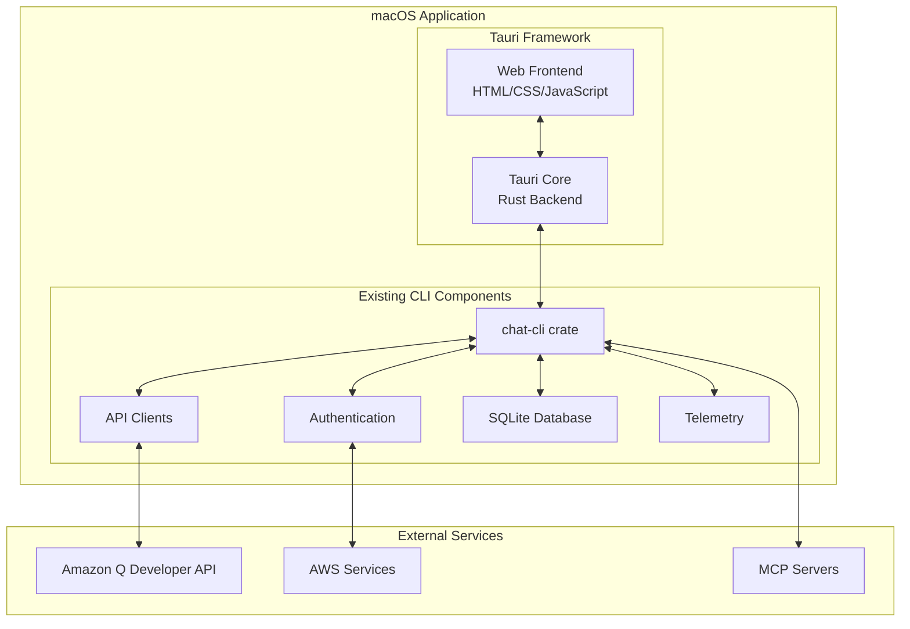

# Design Document

## Overview

Amazon Q Developer CLIにmacOS向けのGUIインターフェースを追加し、Tauriフレームワークを使用してネイティブなスタンドアローンアプリケーションを作成します。このデザインでは、既存のRustベースのCLI機能を活用しながら、直感的なWebベースのフロントエンドを提供します。

## Architecture

### High-Level Architecture



### Technology Stack

- **フレームワーク**: Tauri 1.6.0 (既存のビルドスクリプトで指定済み)
- **フロントエンド**: Next.js 15 + TypeScript + React 18
- **バックエンド**: Rust (既存のchat-cliクレートを活用)
- **UI Framework**: 
  - **CSS**: Tailwind CSS (ユーティリティファースト)
  - **コンポーネント**: React Server Components + カスタムコンポーネント
- **状態管理**: Zustand (軽量で型安全な状態管理)
- **ビルドツール**: Next.js内蔵のWebpack/Turbopack
- **静的エクスポート**: `output: 'export'` (Tauri互換性のため)
- **通信**: Tauri Commands (Rust ↔ JavaScript)

## Components and Interfaces

### 1. Tauri Application Structure

```
crates/fig_desktop/
├── src/                     # Rust backend
│   ├── main.rs              # Tauriアプリケーションのエントリーポイント
│   ├── commands/            # Tauri commands (CLI機能のラッパー)
│   │   ├── mod.rs
│   │   ├── chat.rs          # チャット関連コマンド
│   │   ├── auth.rs          # 認証関連コマンド
│   │   ├── settings.rs      # 設定関連コマンド
│   │   └── file_ops.rs      # ファイル操作コマンド
│   ├── state/               # アプリケーション状態管理
│   │   ├── mod.rs
│   │   ├── conversation.rs  # 会話状態
│   │   └── app_config.rs    # アプリ設定
│   └── utils/               # ユーティリティ関数
│       ├── mod.rs
│       └── cli_bridge.rs    # CLI機能との橋渡し
├── src-tauri/
│   ├── tauri.conf.json      # Tauri設定ファイル
│   ├── build.rs             # ビルドスクリプト
│   └── icons/               # アプリケーションアイコン
└── ui/                      # Next.js frontend
    ├── package.json         # Node.js dependencies
    ├── next.config.mjs      # Next.js設定（静的エクスポート対応）
    ├── tsconfig.json        # TypeScript設定
    ├── tailwind.config.ts   # Tailwind CSS設定
    ├── postcss.config.mjs   # PostCSS設定
    ├── app/                 # Next.js App Router
    │   ├── layout.tsx       # ルートレイアウト
    │   ├── page.tsx         # ホームページ
    │   ├── globals.css      # グローバルCSS
    │   ├── chat/
    │   │   └── page.tsx     # チャットページ
    │   ├── settings/
    │   │   └── page.tsx     # 設定ページ
    │   └── auth/
    │       └── page.tsx     # 認証ページ
    ├── components/          # Reactコンポーネント
    │   ├── ui/              # 基本UIコンポーネント
    │   │   ├── button.tsx
    │   │   ├── input.tsx
    │   │   ├── card.tsx
    │   │   └── spinner.tsx
    │   ├── chat/
    │   │   ├── chat-window.tsx
    │   │   ├── message-list.tsx
    │   │   ├── message-input.tsx
    │   │   └── message-item.tsx
    │   ├── layout/
    │   │   ├── sidebar.tsx
    │   │   ├── header.tsx
    │   │   └── status-bar.tsx
    │   ├── settings/
    │   │   └── settings-panel.tsx
    │   └── auth/
    │       └── auth-panel.tsx
    ├── hooks/               # カスタムReact hooks
    │   ├── use-chat.ts
    │   ├── use-auth.ts
    │   ├── use-settings.ts
    │   └── use-tauri.ts
    ├── stores/              # Zustand stores
    │   ├── chat-store.ts
    │   ├── auth-store.ts
    │   └── settings-store.ts
    ├── lib/                 # ユーティリティとAPI
    │   ├── tauri.ts         # Tauri API呼び出し
    │   ├── utils.ts         # 汎用ユーティリティ
    │   └── constants.ts     # 定数定義
    ├── types/               # TypeScript型定義
    │   ├── chat.ts
    │   ├── auth.ts
    │   └── common.ts
    └── public/              # 静的リソース
        ├── icons/
        ├── images/
        └── favicon.ico
```

### 2. Core Tauri Commands

#### Chat Commands
```rust
#[tauri::command]
async fn send_message(
    state: tauri::State<'_, AppState>,
    message: String,
    conversation_id: Option<String>,
) -> Result<ChatResponse, String>

#[tauri::command]
async fn get_conversation_history(
    state: tauri::State<'_, AppState>,
    conversation_id: String,
) -> Result<Vec<Message>, String>

#[tauri::command]
async fn start_new_conversation(
    state: tauri::State<'_, AppState>,
) -> Result<String, String> // Returns conversation_id
```

#### Authentication Commands
```rust
#[tauri::command]
async fn login(
    state: tauri::State<'_, AppState>,
) -> Result<AuthStatus, String>

#[tauri::command]
async fn logout(
    state: tauri::State<'_, AppState>,
) -> Result<(), String>

#[tauri::command]
async fn get_auth_status(
    state: tauri::State<'_, AppState>,
) -> Result<AuthStatus, String>
```

#### File Operations Commands
```rust
#[tauri::command]
async fn read_file_content(
    file_path: String,
) -> Result<String, String>

#[tauri::command]
async fn save_file_content(
    file_path: String,
    content: String,
) -> Result<(), String>
```

### 3. Frontend Components Architecture

#### Main Application Structure
```typescript
interface AppState {
  currentConversation: Conversation | null;
  conversations: Conversation[];
  authStatus: AuthStatus;
  settings: AppSettings;
  isLoading: boolean;
}

interface Conversation {
  id: string;
  title: string;
  messages: Message[];
  createdAt: Date;
  updatedAt: Date;
}

interface Message {
  id: string;
  role: 'user' | 'assistant';
  content: string;
  timestamp: Date;
  toolUses?: ToolUse[];
}
```

#### Key UI Components (Next.js + React)

1. **ChatWindow**: メインのチャット画面コンポーネント
2. **MessageList**: メッセージ履歴の表示（仮想スクロール対応）
3. **MessageInput**: ユーザー入力フィールド（マークダウン対応）
4. **MessageItem**: 個別メッセージコンポーネント（構文ハイライト付き）
5. **Sidebar**: 会話履歴とナビゲーション
6. **SettingsPanel**: 設定画面（タブ形式）
7. **AuthPanel**: ログイン/ログアウト画面
8. **FileDropZone**: ファイルドラッグ&ドロップ領域
9. **LoadingSpinner**: ローディング表示コンポーネント
10. **NotificationToast**: 通知表示コンポーネント

#### React Hooks and Zustand Store Examples

```typescript
// hooks/use-chat.ts
import { useState } from 'react'
import { invoke } from '@tauri-apps/api/tauri'
import { useChatStore } from '@/stores/chat-store'

export function useChat() {
  const [isLoading, setIsLoading] = useState(false)
  const { refreshConversation } = useChatStore()
  
  const sendMessage = async (message: string) => {
    setIsLoading(true)
    try {
      await invoke('send_message', { message })
      await refreshConversation()
    } catch (error) {
      console.error('Failed to send message:', error)
    } finally {
      setIsLoading(false)
    }
  }
  
  return {
    isLoading,
    sendMessage
  }
}

// stores/chat-store.ts (Zustand)
import { create } from 'zustand'
import { invoke } from '@tauri-apps/api/tauri'
import type { Conversation, Message } from '@/types/chat'

interface ChatState {
  currentConversation: Conversation | null
  conversations: Conversation[]
  isLoading: boolean
  sendMessage: (message: string) => Promise<void>
  refreshConversation: () => Promise<void>
  setCurrentConversation: (conversation: Conversation | null) => void
}

export const useChatStore = create<ChatState>((set, get) => ({
  currentConversation: null,
  conversations: [],
  isLoading: false,
  
  sendMessage: async (message: string) => {
    set({ isLoading: true })
    try {
      const response = await invoke('send_message', { message })
      // 状態更新ロジック
      await get().refreshConversation()
    } catch (error) {
      console.error('Failed to send message:', error)
    } finally {
      set({ isLoading: false })
    }
  },
  
  refreshConversation: async () => {
    // 会話履歴の更新ロジック
  },
  
  setCurrentConversation: (conversation) => {
    set({ currentConversation: conversation })
  }
}))
```

#### Next.js Configuration for Tauri

```javascript
// next.config.mjs
const isProd = process.env.NODE_ENV === 'production'
const internalHost = process.env.TAURI_DEV_HOST || 'localhost'

/** @type {import('next').NextConfig} */
const nextConfig = {
  // Tauriで動作させるための最重要設定
  output: 'export',
  
  // 静的エクスポート時の設定
  trailingSlash: true,
  skipTrailingSlashRedirect: true,
  
  // 画像最適化を無効化（静的エクスポート時に必要）
  images: {
    unoptimized: true,
  },
  
  // 開発時にアセットを正しく読み込むための設定
  assetPrefix: isProd ? undefined : `http://${internalHost}:3000`,
  
  // TypeScript設定
  typescript: {
    ignoreBuildErrors: false,
  },
  
  // ESLint設定
  eslint: {
    ignoreDuringBuilds: false,
  },
}

export default nextConfig
```

## Data Models

### Conversation State
```rust
#[derive(Debug, Clone, Serialize, Deserialize)]
pub struct GuiConversationState {
    pub id: String,
    pub title: String,
    pub messages: Vec<GuiMessage>,
    pub agent: Option<String>,
    pub model: Option<String>,
    pub created_at: OffsetDateTime,
    pub updated_at: OffsetDateTime,
}

#[derive(Debug, Clone, Serialize, Deserialize)]
pub struct GuiMessage {
    pub id: String,
    pub role: MessageRole,
    pub content: String,
    pub timestamp: OffsetDateTime,
    pub tool_uses: Vec<GuiToolUse>,
    pub metadata: Option<MessageMetadata>,
}

#[derive(Debug, Clone, Serialize, Deserialize)]
pub enum MessageRole {
    User,
    Assistant,
    System,
}
```

### Application Configuration
```rust
#[derive(Debug, Clone, Serialize, Deserialize)]
pub struct AppConfig {
    pub window_settings: WindowSettings,
    pub chat_settings: ChatSettings,
    pub appearance: AppearanceSettings,
}

#[derive(Debug, Clone, Serialize, Deserialize)]
pub struct WindowSettings {
    pub width: u32,
    pub height: u32,
    pub x: Option<i32>,
    pub y: Option<i32>,
    pub maximized: bool,
}
```

## Error Handling

### Error Types
```rust
#[derive(Debug, thiserror::Error, Serialize)]
pub enum GuiError {
    #[error("CLI operation failed: {0}")]
    CliError(String),
    
    #[error("Authentication error: {0}")]
    AuthError(String),
    
    #[error("File operation error: {0}")]
    FileError(String),
    
    #[error("Network error: {0}")]
    NetworkError(String),
    
    #[error("Configuration error: {0}")]
    ConfigError(String),
}
```

### Error Handling Strategy
1. **Graceful Degradation**: ネットワークエラー時でもローカル機能は継続
2. **User-Friendly Messages**: 技術的なエラーをユーザーフレンドリーなメッセージに変換
3. **Error Recovery**: 可能な場合は自動復旧を試行
4. **Logging**: 詳細なエラーログをファイルに記録

## Testing Strategy

### Unit Tests
```rust
#[cfg(test)]
mod tests {
    use super::*;
    
    #[tokio::test]
    async fn test_send_message_command() {
        // Tauri commandのテスト
    }
    
    #[tokio::test]
    async fn test_conversation_state_management() {
        // 会話状態管理のテスト
    }
}
```

### Integration Tests
```typescript
// Frontend integration tests (Jest + React Testing Library)
import { describe, test, expect } from '@jest/globals'
import { render, screen, fireEvent, waitFor } from '@testing-library/react'
import userEvent from '@testing-library/user-event'
import { ChatWindow } from '@/components/chat/chat-window'

// Tauri APIのモック
jest.mock('@tauri-apps/api/tauri', () => ({
  invoke: jest.fn()
}))

describe('Chat Interface', () => {
  test('should send message and receive response', async () => {
    const user = userEvent.setup()
    render(<ChatWindow />)
    
    const messageInput = screen.getByTestId('message-input')
    const sendButton = screen.getByTestId('send-button')
    
    await user.type(messageInput, 'Hello, Q!')
    await user.click(sendButton)
    
    // メッセージが送信されることを確認
    await waitFor(() => {
      expect(require('@tauri-apps/api/tauri').invoke).toHaveBeenCalledWith(
        'send_message',
        { message: 'Hello, Q!' }
      )
    })
  })
  
  test('should handle file drag and drop', async () => {
    render(<ChatWindow />)
    const dropZone = screen.getByTestId('file-drop-zone')
    
    // ファイルドロップイベントをシミュレート
    const file = new File(['test content'], 'test.txt', { type: 'text/plain' })
    const dropEvent = new Event('drop', { bubbles: true })
    Object.defineProperty(dropEvent, 'dataTransfer', {
      value: {
        files: [file]
      }
    })
    
    fireEvent(dropZone, dropEvent)
    
    // ファイルが処理されることを確認
    await waitFor(() => {
      expect(require('@tauri-apps/api/tauri').invoke).toHaveBeenCalledWith(
        'add_file_context',
        expect.objectContaining({
          fileName: 'test.txt'
        })
      )
    })
  })
})

// E2E Tests with Playwright
import { test, expect } from '@playwright/test'

test.describe('Desktop App E2E', () => {
  test('should launch and display chat interface', async ({ page }) => {
    // Tauriアプリの起動をシミュレート
    await page.goto('/')
    
    // チャット画面が表示されることを確認
    await expect(page.getByTestId('chat-window')).toBeVisible()
    await expect(page.getByTestId('message-input')).toBeVisible()
    await expect(page.getByTestId('send-button')).toBeVisible()
  })
  
  test('should handle authentication flow', async ({ page }) => {
    await page.goto('/auth')
    
    // ログインボタンをクリック
    await page.getByTestId('login-button').click()
    
    // 認証が成功することを確認
    await expect(page.getByTestId('auth-success')).toBeVisible()
  })
})
```

### End-to-End Tests
- Tauriの`tauri-driver`を使用したE2Eテスト
- 実際のユーザーワークフローのテスト
- macOS固有の機能テスト

## Implementation Details

### 1. CLI Integration Bridge

既存のCLI機能をGUIから利用するためのブリッジレイヤー:

```rust
pub struct CliBridge {
    os: Arc<Mutex<Os>>,
}

impl CliBridge {
    pub async fn execute_chat_command(
        &self,
        args: ChatArgs,
    ) -> Result<ChatResponse, GuiError> {
        let mut os = self.os.lock().await;
        
        // 既存のCLI機能を呼び出し
        let result = args.execute(&mut os).await
            .map_err(|e| GuiError::CliError(e.to_string()))?;
            
        Ok(ChatResponse::from(result))
    }
}
```

### 2. Streaming Response Handling

リアルタイムなチャット体験のためのストリーミング実装:

```rust
#[tauri::command]
async fn send_message_stream(
    app: tauri::AppHandle,
    state: tauri::State<'_, AppState>,
    message: String,
) -> Result<String, String> {
    let conversation_id = uuid::Uuid::new_v4().to_string();
    
    tokio::spawn(async move {
        // ストリーミングレスポンスを処理
        let mut stream = get_chat_stream(message).await;
        
        while let Some(chunk) = stream.next().await {
            // フロントエンドにチャンクを送信
            app.emit_all("message_chunk", &chunk).unwrap();
        }
        
        app.emit_all("message_complete", &conversation_id).unwrap();
    });
    
    Ok(conversation_id)
}
```

### 3. File Drag & Drop Implementation (Next.js + React)

```tsx
// components/chat/file-drop-zone.tsx
'use client'

import { useState, useCallback } from 'react'
import { invoke } from '@tauri-apps/api/tauri'
import { Upload, FilePlus } from 'lucide-react'

interface FileDropZoneProps {
  onFileAdded?: (fileName: string) => void
}

export function FileDropZone({ onFileAdded }: FileDropZoneProps) {
  const [isDragOver, setIsDragOver] = useState(false)

  const handleDragOver = useCallback((e: React.DragEvent) => {
    e.preventDefault()
    setIsDragOver(true)
  }, [])

  const handleDragLeave = useCallback(() => {
    setIsDragOver(false)
  }, [])

  const handleDrop = useCallback(async (e: React.DragEvent) => {
    e.preventDefault()
    setIsDragOver(false)
    
    const files = Array.from(e.dataTransfer.files)
    
    for (const file of files) {
      try {
        const content = await readFileAsText(file)
        await invoke('add_file_context', {
          fileName: file.name,
          content: content
        })
        onFileAdded?.(file.name)
      } catch (error) {
        console.error('Failed to process file:', error)
      }
    }
  }, [onFileAdded])

  const readFileAsText = (file: File): Promise<string> => {
    return new Promise((resolve, reject) => {
      const reader = new FileReader()
      reader.onload = () => resolve(reader.result as string)
      reader.onerror = reject
      reader.readAsText(file)
    })
  }

  return (
    <div
      className={`
        file-drop-zone border-2 border-dashed rounded-lg p-8 text-center transition-colors
        ${isDragOver 
          ? 'border-blue-500 bg-blue-50 dark:bg-blue-950' 
          : 'border-gray-300 dark:border-gray-600 hover:border-gray-400'
        }
      `}
      onDrop={handleDrop}
      onDragOver={handleDragOver}
      onDragLeave={handleDragLeave}
    >
      {!isDragOver ? (
        <div className="drop-message">
          <Upload className="mx-auto h-12 w-12 text-gray-400 mb-4" />
          <p className="text-gray-600 dark:text-gray-400">
            ファイルをドラッグ&ドロップしてください
          </p>
        </div>
      ) : (
        <div className="drop-active">
          <FilePlus className="mx-auto h-12 w-12 text-blue-500 mb-4" />
          <p className="text-blue-600 dark:text-blue-400">
            ファイルをドロップしてください
          </p>
        </div>
      )}
    </div>
  )
}
```
```

### 4. macOS Native Integration

```rust
// macOS固有の機能統合
#[cfg(target_os = "macos")]
mod macos {
    use objc2_app_kit::NSWorkspace;
    
    pub fn open_in_finder(path: &str) -> Result<(), String> {
        // Finderでファイルを開く
        NSWorkspace::shared_workspace()
            .select_file(path)
            .map_err(|e| e.to_string())
    }
}
```

## Security Considerations

### 1. File System Access
- Tauriの`fs` APIを使用して安全なファイルアクセスを実装
- ユーザーが明示的に選択したファイルのみアクセス許可

### 2. Network Security
- 既存のCLI認証システムを活用
- HTTPS通信の強制
- 証明書の検証

### 3. Data Protection
- ローカルデータベースの暗号化
- 機密情報のメモリクリア
- セキュアなログ出力

## Performance Optimization

### 1. Memory Management
```rust
// 大きな会話履歴の効率的な管理
pub struct ConversationManager {
    active_conversations: LruCache<String, GuiConversationState>,
    max_memory_usage: usize,
}
```

### 2. UI Responsiveness
- Virtual scrolling for large message lists
- Lazy loading of conversation history
- Debounced user input handling

### 3. Resource Usage
- Background task management
- Efficient WebView memory usage
- Optimized asset loading

## Deployment and Distribution

### 1. Build Process Integration

既存のビルドスクリプトとの統合:

```python
# scripts/build.py への追加
def build_desktop_app(signing_data: CdSigningData | None):
    """Build the Tauri desktop application."""
    info("Building desktop application")
    
    # Tauri build command
    run_cmd([
        "cargo", "+1.79.0", "tauri", "build",
        "--target", "universal-apple-darwin"
    ], cwd=DESKTOP_PACKAGE_PATH)
    
    if signing_data:
        sign_and_notarize_app(signing_data)
```

### 2. DMG Creation
```python
def create_dmg():
    """Create DMG package for distribution."""
    dmg_settings = {
        'filename': f'{APP_NAME}.dmg',
        'volume_name': APP_NAME,
        'format': 'UDBZ',
        'size': '100M',
        'files': [
            f'target/universal-apple-darwin/release/bundle/macos/{APP_NAME}.app'
        ]
    }
    
    run_dmgbuild(dmg_settings)
```

### 3. Code Signing and Notarization
- 既存のApple Developer証明書を使用
- 自動公証プロセスの統合
- Gatekeeper対応

## Migration Strategy

### Phase 1: Core Infrastructure
1. `fig_desktop`クレートの作成
2. 基本的なTauri設定
3. CLI bridgeの実装

### Phase 2: Basic GUI
1. シンプルなチャットインターフェース
2. 認証機能の統合
3. 基本的なメッセージ送受信

### Phase 3: Advanced Features
1. ファイルドラッグ&ドロップ
2. 設定画面
3. 会話履歴管理

### Phase 4: Polish and Distribution
1. macOSネイティブ機能の統合
2. パフォーマンス最適化
3. DMG配布の自動化

## Framework Selection Rationale

### Next.js 15を選択する理由

1. **成熟したエコシステム**: Reactベースで豊富なライブラリとコミュニティサポート
2. **TypeScript統合**: ファーストクラスのTypeScriptサポート
3. **パフォーマンス**: 最適化されたバンドルとコード分割
4. **開発体験**: 優れた開発ツールとホットリロード
5. **静的エクスポート**: Tauri互換性のための`output: 'export'`サポート
6. **App Router**: モダンなルーティングシステム

### Tauriとの互換性

Next.jsをTauriで使用する際の重要な考慮事項：

1. **静的エクスポート**: SSRではなくSSG（Static Site Generation）を使用
2. **ファイルシステムルーティング**: App Routerによる直感的なページ構造
3. **アセット管理**: 静的リソースの適切な処理
4. **API Routes**: Tauriコマンドを使用するため、Next.js API Routesは使用しない

## Development Tools and Setup

### 開発環境セットアップ
```json
// package.json
{
  "name": "q-desktop-ui",
  "version": "1.0.0",
  "private": true,
  "scripts": {
    "dev": "next dev",
    "build": "next build",
    "start": "next start",
    "lint": "next lint",
    "type-check": "tsc --noEmit",
    "test": "jest",
    "test:watch": "jest --watch",
    "test:e2e": "playwright test"
  },
  "dependencies": {
    "next": "^15.0.0",
    "react": "^18.0.0",
    "react-dom": "^18.0.0",
    "@tauri-apps/api": "^1.6.0",
    "zustand": "^4.4.0",
    "lucide-react": "^0.400.0",
    "clsx": "^2.0.0",
    "tailwind-merge": "^2.0.0"
  },
  "devDependencies": {
    "@types/node": "^20.0.0",
    "@types/react": "^18.0.0",
    "@types/react-dom": "^18.0.0",
    "typescript": "^5.0.0",
    "tailwindcss": "^3.4.0",
    "postcss": "^8.4.0",
    "autoprefixer": "^10.4.0",
    "eslint": "^8.0.0",
    "eslint-config-next": "^15.0.0",
    "@typescript-eslint/eslint-plugin": "^6.0.0",
    "prettier": "^3.0.0",
    "jest": "^29.0.0",
    "@testing-library/react": "^14.0.0",
    "@testing-library/jest-dom": "^6.0.0",
    "@playwright/test": "^1.40.0"
  }
}
```

### Tauri設定
```json
// src-tauri/tauri.conf.json
{
  "build": {
    "beforeDevCommand": "npm run dev",
    "beforeBuildCommand": "npm run build",
    "devUrl": "http://localhost:3000",
    "frontendDist": "../ui/out"
  },
  "package": {
    "productName": "Amazon Q",
    "version": "1.0.0"
  },
  "tauri": {
    "allowlist": {
      "all": false,
      "shell": {
        "all": false,
        "open": true
      },
      "dialog": {
        "all": false,
        "open": true,
        "save": true
      },
      "fs": {
        "all": false,
        "readFile": true,
        "writeFile": true,
        "readDir": true,
        "copyFile": true,
        "createDir": true,
        "removeDir": true,
        "removeFile": true,
        "renameFile": true
      }
    },
    "bundle": {
      "active": true,
      "targets": "all",
      "identifier": "com.amazon.q-desktop",
      "icon": [
        "icons/32x32.png",
        "icons/128x128.png",
        "icons/128x128@2x.png",
        "icons/icon.icns",
        "icons/icon.ico"
      ]
    },
    "security": {
      "csp": null
    },
    "windows": [
      {
        "fullscreen": false,
        "resizable": true,
        "title": "Amazon Q",
        "width": 1200,
        "height": 800,
        "minWidth": 800,
        "minHeight": 600
      }
    ]
  }
}
```

## Future Enhancements

### 1. Advanced UI Features
- Split view for code editing
- Integrated terminal
- Plugin system for custom tools
- Theme customization system
- Keyboard shortcuts customization

### 2. Cross-Platform Support
- Windows版の開発（同じVue.jsコードベースを活用）
- Linux版の開発
- 統一されたUI/UX

### 3. Enhanced Integration
- IDE plugins
- Browser extensions
- Mobile companion apps
- VS Code extension integration